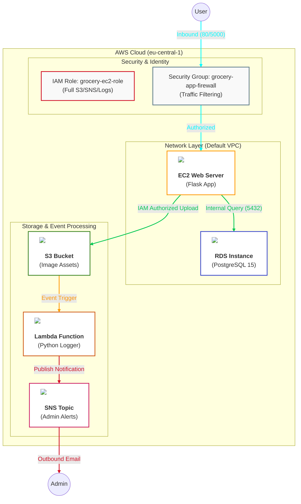

# GroceryMate

## 🏆 GroceryMate E-Commerce Platform

[](https://www.python.org/)
[](https://www.kernel.org/)
[](https://www.postgresql.org/)
[](https://github.com/AlejandroRomanIbanez/AWS_grocery/releases/tag/v2.0.0)
[](#-license)

⭐ **Star us on GitHub** — it motivates us a lot!

---

## 📌 Table of Contents

- [Overview](#-overview)
- [Features](#-features)
- [Screenshots & Demo](#-screenshots--demo)
- [Cloud Infrastructure](#-cloud-infrastructure-aws--terraform)
- [Prerequisites](#-prerequisites)
- [Installation](#-installation)
  - [Clone Repository](#-clone-repository)
  - [Configure PostgreSQL](#-configure-postgresql)
  - [Populate Database](#-populate-database)
  - [Set Up Python Environment](#-set-up-python-environment)
  - [Set Environment Variables](#-set-environment-variables)
  - [Start the Application](#-start-the-application)
- [Usage](#-usage)
- [Contributing](#-contributing)
- [License](#-license)

## 🚀 Overview

GroceryMate is an application developed as part of the Masterschools program by **Alejandro Roman Ibanez**, with **Cloud Infrastructure & DevOps automation** designed and implemented by **Youssef El Maach**. It is a modern, full-featured e-commerce platform designed for seamless online grocery shopping. It provides an intuitive user interface and a secure backend, allowing users to browse products, manage their shopping basket, and complete purchases efficiently.

GroceryMate is a modern, full-featured e-commerce platform designed for seamless online grocery shopping. It provides an intuitive user interface and a secure backend, allowing users to browse products, manage their shopping basket, and complete purchases efficiently.

## 🛒 Features

- **🛡️ User Authentication**: Secure registration, login, and session management.
- **🔒 Protected Routes**: Access control for authenticated users.
- **🔎 Product Search & Filtering**: Browse products, apply filters, and sort by category or price.
- **⭐ Favorites Management**: Save preferred products.
- **🛍️ Shopping Basket**: Add, view, modify, and remove items.
- **💳 Checkout Process**:
  - Secure billing and shipping information handling.
  - Multiple payment options.
  - Automatic total price calculation.

## 📸 Screenshots & Demo


https://github.com/user-attachments/assets/d1c5c8e4-5b16-486a-b709-4cf6e6cce6bc


### 🏗 Architecture Highlights
* **Web & Database:** Hosted on **AWS EC2** (t2.micro) and **AWS RDS** (PostgreSQL 15). The network is secured via a **custom Security Group** ("grocery-app-firewall") allowing specific traffic on ports 22 (SSH), 80 (HTTP), 5000 (Flask), and 5432 (Postgres).
* **Storage & Folders:** An **S3 Bucket** (`grocery-yssf`) manages assets with a dedicated `avatars/` directory structure, ensuring organized object storage.
* **Security & IAM:** Implemented the **Principle of Least Privilege** using a custom IAM Role (`grocery-ec2-role`). This allows the EC2 instance and Lambda function to interact securely with S3 and SNS without using hardcoded credentials.

### 🚨 Serverless Monitoring & Notifications
We implemented a fully decoupled, event-driven pipeline:
1. **S3 Event Trigger:** Automatically detects `s3:ObjectCreated:*` events in the bucket.
2. **AWS Lambda:** A Python-based function ("Logger") that assumes the IAM role to process metadata and log system activity.
3. **SNS Alerts:** Dispatches real-time email notifications via an **SNS Topic**, ensuring the administrator is informed of every successful upload.



## 📋 Prerequisites

Ensure the following dependencies are installed before running the application:

- **🐍 Python (>=3.11)**
- **🐘 PostgreSQL** – Database for storing product and user information.
- **🛠️ Git** – Version control system.

## ⚙️ Installation

### 🔹 Clone Repository

```sh
git clone --branch version2 https://github.com/AlejandroRomanIbanez/AWS_grocery.git && cd AWS_grocery
```

### 🔹 Configure PostgreSQL

Before creating the database user, you can choose a custom username and password to enhance security. Replace `<your_secure_password>` with a strong password of your choice in the following commands.

Create database and user:

```sh
psql -U postgres -c "CREATE DATABASE grocerymate_db;"
psql -U postgres -c "CREATE USER grocery_user WITH ENCRYPTED PASSWORD '<your_secure_password>';"  # Replace <your_secure_password> with a strong password of your choice
psql -U postgres -c "ALTER USER grocery_user WITH SUPERUSER;"
```

### 🔹 Populate Database

```sh
psql -U grocery_user -d grocerymate_db -f backend/app/sqlite_dump_clean.sql
```

Verify insertion:

```sh
psql -U grocery_user -d grocerymate_db -c "SELECT * FROM users;"
psql -U grocery_user -d grocerymate_db -c "SELECT * FROM products;"
```

### 🔹 Set Up Python Environment


Install dependencies in an activated virtual Enviroment:

```sh
cd backend
pip install -r requirements.txt
```
OR (if pip doesn't exist)
```sh
pip3 install -r requirements.txt
```

### 🔹 Set Environment Variables

Create a `.env` file:

```sh
touch .env  # macOS/Linux
ni .env -Force  # Windows
```

Generate a secure JWT key:

```sh
python3 -c "import secrets; print(secrets.token_hex(32))"
```

Update `.env`:

```sh
nano .env
```

Fill in the following information (make sure to replace the placeholders):

```ini
JWT_SECRET_KEY=<your_generated_key>
POSTGRES_USER=grocery_user
POSTGRES_PASSWORD=<your_password>
POSTGRES_DB=grocerymate_db
POSTGRES_HOST=localhost
POSTGRES_URI=postgresql://${POSTGRES_USER}:${POSTGRES_PASSWORD}@${POSTGRES_HOST}:5432/${POSTGRES_DB}
```

### 🔹 Start the Application

```sh
python3 run.py
```

## 📖 Usage

- Access the application at [http://localhost:5000](http://localhost:5000)
- Register/Login to your account
- Browse and search for products
- Manage favorites and shopping basket
- Proceed through the checkout process

## 🤝 Contributing

We welcome contributions! Please follow these steps:

1. Fork the repository.
2. Create a new feature branch (`feature/your-feature`).
3. Implement your changes and commit them.
4. Push your branch and create a pull request.

## 📜 License

This project is licensed under the MIT License.


